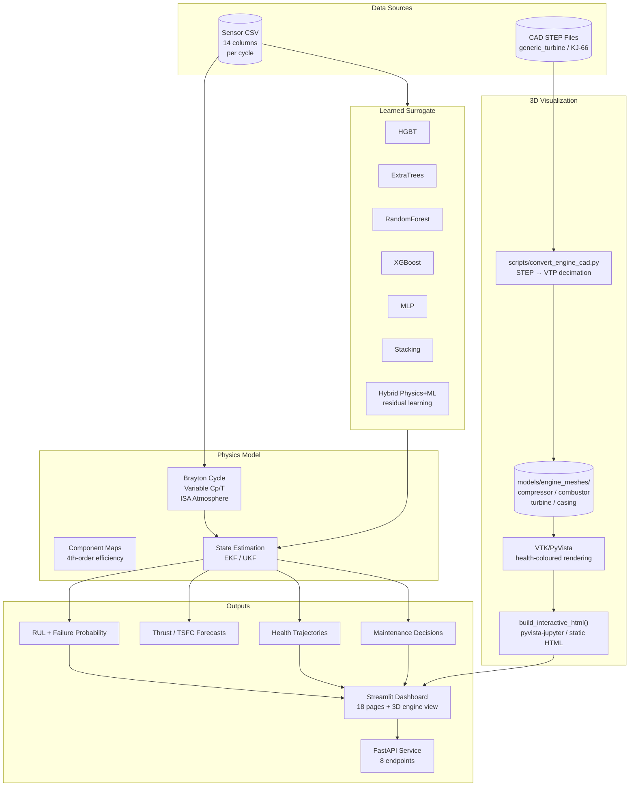
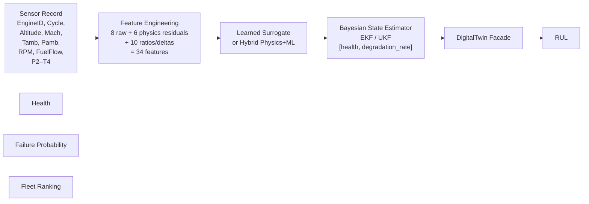
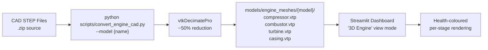

# Chapter 1: Turbojet Digital Twin — Overview

Physics-informed digital twin for four-stage turbojet health monitoring, RUL prediction, condition-based maintenance, and **interactive 3D engine visualization**.

**Documentation Series**

| # | Chapter | Description |
|---|---------|-------------|
| 1 | **README** (this page) | Project overview, quick start, CLI & API reference |
| 2 | [Theory](docs/Theory.md) | Thermodynamics, state estimation, surrogate modelling, prognostics |
| 3 | [Equations](docs/Equations.md) | Full mathematical formulation with all equations |
| 4 | [Architecture](docs/ARCHITECTURE.md) | Module dependencies, data flow, design decisions |
| 5 | [Dataset](docs/DATA.md) | Schema, feature engineering, split strategies |
| 6 | [Validation](docs/Validation.md) | Model comparison tables, per-target metrics, benchmarks |
| — | [Research](../research/) | Bibliography, ablation studies, figures, experiments |

---

## Why This Project?

Gas turbine health monitoring sits at the intersection of physics-based modelling and machine learning — two communities that rarely speak to each other. Physics models (Brayton cycle, component maps) generalise across the flight envelope but are too slow for real-time inference; pure ML models are fast but fail on off-design conditions not represented in training.

This project bridges that gap with a **hybrid residual-learning architecture**: a thermodynamic baseline handles operating-condition physics, and a tree ensemble learns only the degradation residual. The result is a model that is both physically consistent and fast enough for sub-2 ms per-row inference — without sacrificing calibrated uncertainty.

Beyond the code, the project is documented as a complete research narrative: theory with diagrams and citations, full equations with source attribution, comparison tables against published baselines (including NASA C-MAPSS), and a living research folder with paper template, poster, and ablation studies. The goal is a template for how applied ML projects *should* document themselves.

---

## Architecture



## Data Flow



## Features

- **Physics core** — Brayton-cycle thermodynamic reconstruction, variable Cp(T), ISA atmosphere, 4th-order component maps, spool energy balance
- **State estimation** — EKF and UKF with identity observation Jacobian, constant-degradation prior
- **Learned surrogate** — Multi-output health/performance regression: HGBT, ExtraTrees, RandomForest, Stacking, XGBoost, MLP, Hybrid Physics+ML
- **Hybrid Physics+ML** — ML learns the residual: `prediction = physics + ml_residual`
- **Uncertainty quantification** — Conformal prediction, quantile regression, adaptive conformal, bootstrapped ensemble
- **Explainability** — SHAP values with permutation importance fallback, root cause analysis
- **Prognostics** — RUL quantiles, data-calibrated failure probability, thrust/fuel-efficiency forecasts
- **Maintenance** — CBM scheduler with five-option decision engine (cost, downtime, risk, RUL gain)
- **What-if simulator** — Adjust fuel flow, RPM, ambient conditions, component efficiency, sensor noise
- **Fault injection** — Compressor fouling, turbine erosion, fuel nozzle blockage, bearing wear, sensor drift/bias
- **Serving** — FastAPI (8 endpoints) + Streamlit dashboard (17 pages + 3D engine view)
- **3D engine visualization** — Configurable CAD model support: **generic_turbine** (30 parts) or **KJ-66 micro-turbojet** (22-component assembly) with health-coloured part rendering
- **Fleet operations** — Cross-engine ranking, drift monitoring, comparative analytics

## 3D Engine Visualization

Two CAD models are available, selected via the dashboard Settings page or `configs/viz_config.yaml`:

| Model | Source | Parts | Loader |
|-------|--------|-------|--------|
| `generic_turbine` | 30 individual `.stp` files | Compressor, combustor, turbine, casing groups | Per-file cadquery import |
| `kj66` | Single `.stp` assembly (XCAF) | 22 components across 4 groups | XCAF/OCAF `STEPCAFControl_Reader` |



**Convert a model:**
```powershell
python scripts/convert_engine_cad.py --model generic_turbine
python scripts/convert_engine_cad.py --model kj66
```

**Switch active model:**
- **Dashboard:** Settings page → "Active CAD model" dropdown (persisted in session state)
- **Config:** Edit `configs/viz_config.yaml` → set `active_engine_model`

## Quick Start

```powershell
# Environment
python -m venv .venv
.venv\Scripts\pip install -e ".[dev,api,dashboard,reports]"
pip install shap psutil

# Smoke test
python pipeline.py demo
pytest -m "not slow"

# Train
python pipeline.py train --data data/turbojet_complete_dataset.csv --kind hybrid --output models/hybrid.joblib

# Full orchestration
python pipeline.py orchestrate --data data/turbojet_complete_dataset.csv --output-dir results

# Serve
uvicorn src.api.server:app --reload          # API at http://localhost:8000
streamlit run src/viz/dashboard.py           # Dashboard at http://localhost:8501

# Build 3D engine meshes (required before using the 3D view)
python scripts/convert_engine_cad.py --model generic_turbine
python scripts/convert_engine_cad.py --model kj66
```

## CLI Reference

| Command | Purpose |
|---------|---------|
| `train` | Train a single model variant |
| `tune` | Grid-search hyperparameters |
| `evaluate` | Evaluate a saved model on held-out data |
| `predict` | Run batch inference |
| `experiment` | Run a logged experiment with config and metrics |
| `ablation` | Cross-model ablation study |
| `report` | Generate Markdown report from experiment results |
| `validation` | Full validation suite (4 model kinds x 2 split strategies) |
| `benchmark` | Latency/throughput/memory benchmarks |
| `orchestrate` | End-to-end: train all variants, validate, benchmark |
| `demo` | Sample a real data slice and train a baseline model |

## API Reference

Base URL: `http://localhost:8000`

| Method | Endpoint | Purpose |
|--------|----------|---------|
| GET | `/health` | Liveness probe |
| POST | `/v1/engines/{engine_id}/update` | Push a single sensor reading |
| POST | `/v1/engines/{engine_id}/batch` | Push a batch of cycles for one engine |
| POST | `/v1/scenarios/simulate` | What-if simulation |
| POST | `/v1/engines/{engine_id}/faults` | Replace active fault set |
| GET | `/v1/engines/{engine_id}/faults` | Read active fault set |
| POST | `/v1/engines/{engine_id}/maintenance/options` | Ranked maintenance options |
| POST | `/v1/explain` | SHAP/permutation explanations |

## Project Layout

```
digital_twin/
├── pipeline.py              # CLI entry point
├── config.yaml              # Main configuration
├── configs/
│   ├── cad_models/          # CAD part-to-stage mappings
│   │   ├── generic_turbine.yaml
│   │   └── kj66.yaml
│   └── viz_config.yaml      # 3D viewer and health-colour settings
├── src/
│   ├── physics/             # Brayton cycle, thermodynamics, component maps
│   ├── estimation/          # EKF, UKF state estimators
│   ├── surrogate/           # Surrogate model, hybrid physics+ML
│   ├── uncertainty/         # Conformal, quantile, adaptive conformal
│   ├── explainability/      # SHAP explainer, root cause analysis
│   ├── validation/          # Cross-model validation
│   ├── performance/         # Latency/throughput benchmarks
│   ├── prediction/          # RUL, failure probability, thrust, fuel efficiency
│   ├── maintenance/         # CBM scheduler, economics, decision engine
│   ├── faults/              # Fault injection
│   ├── simulation/          # What-if scenario simulator
│   ├── digital_twin/        # DigitalTwin facade, fleet ranking
│   ├── dataset/             # Loader, preprocessing, feature engineering
│   ├── training/            # Trainer, cross-validation, hyperparameter search
│   ├── metrics/             # Regression, uncertainty and health metrics
│   ├── research/            # Experiment runner, ablation study
│   ├── report/              # Markdown research report generator
│   ├── viz/                 # Streamlit dashboard, plots, 3D engine view
│   └── api/                 # FastAPI service
├── scripts/
│   └── convert_engine_cad.py  # STEP-to-VTP mesh converter
├── models/
│   ├── engine_meshes/       # Decimated VTP meshes per model
│   │   ├── generic_turbine/
│   │   └── kj66/
│   └── *.joblib             # Trained model artifacts
├── tests/                   # 48 fast tests, 4 slow tests
├── docs/                    # Architecture and data documentation
├── data/                    # Datasets
└── results/                 # Run outputs
```

## Configuration

See `config.yaml` for all settings. Key parameters:

| Setting | Default | Purpose |
|---------|---------|---------|
| `model.kind` | `extra_trees` | Surrogate model type |
| `physics.max_temperature_k` | `1900.0` | Turbine inlet temperature limit |
| `runtime.estimator_method` | `ekf` | State estimator |
| `runtime.failure_health_threshold` | `0.3` | RUL = 0 threshold |
| `runtime.warning_health_threshold` | `0.7` | Early warning threshold |

Visualization settings in `configs/viz_config.yaml`:

| Setting | Default | Purpose |
|---------|---------|---------|
| `active_engine_model` | `generic_turbine` | CAD model for 3D view |
| `health_thresholds` | 4 tiers | Colour/label mappings per health band |
| `fault_severity_threshold` | `0.30` | Minimum fault severity for 3D highlight |

## Dataset Contract

One row = one engine cycle. SI units. Health values dimensionless [0, 1].

**Inputs (14 columns):** EngineID, Cycle, Altitude, Mach, Tamb, Pamb, RPM, FuelFlow, P2, T2, P3, T3, P4, T4

**Targets (6 columns):** CompressorHealth, CombustorHealth, TurbineHealth, OverallHealth, Thrust, TSFC

Feature engineering adds 20 derived features (6 physics residuals + 14 ratios/deltas), for 34 total features.

## DigitalTwin Facade

```python
from src.digital_twin.engine import DigitalTwin

twin = DigitalTwin(estimator_method="ekf")
twin.load_model("models/et.joblib")
result = twin.update(observation)
# Contains health, RUL, failure probability, thrust, TSFC, etc.

results = twin.batch_predict(dataframe)
```

## Testing

```bash
pytest -m "not slow"     # 48 fast tests (~60 s)
pytest                   # Full suite (~5 min)
pytest --cov=src         # With coverage
ruff check src/          # Lint
black --check src/       # Format check
```

## Documentation Series

Continue reading:

- **[Chapter 2: Theory](docs/Theory.md)** → Turbojet thermodynamics, EKF, surrogate modelling, RUL, failure probability
- **[Chapter 3: Equations](docs/Equations.md)** → Full mathematical formulation
- **[Chapter 4: Architecture](docs/ARCHITECTURE.md)** → Module dependencies and data flow
- **[Chapter 5: Dataset](docs/DATA.md)** → Schema, features, splits
- **[Chapter 6: Validation](docs/Validation.md)** → Model comparison and benchmarks
- **[Research](../research/)** → Bibliography, ablation studies

## License

MIT
