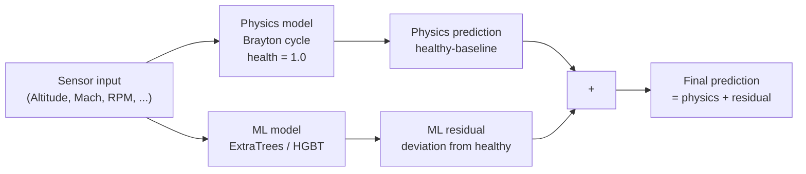
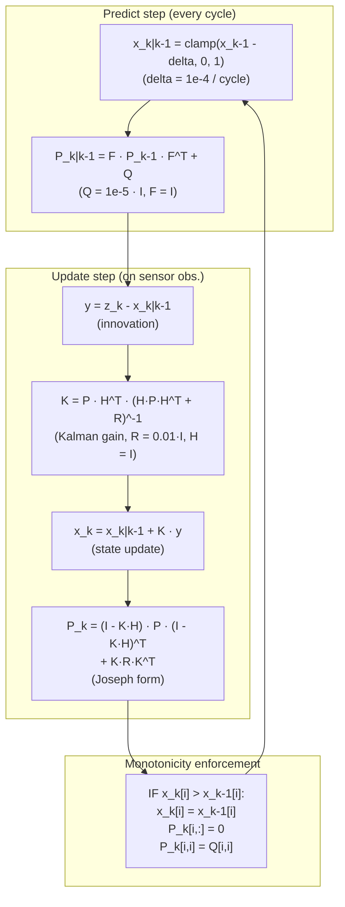

# Chapter 2: Theory

[← Chapter 1: Overview](../README.md) · [Chapter 3: Equations →](Equations.md) · [References](../research/references.bib)

---

## 1 Turbojet Thermodynamics

The engine is modelled as a single-spool turbojet on the Brayton cycle [Mattingly 2002, Walsh & Fletcher 2004]: four continuous processes — compression (inlet + compressor), combustion (constant-pressure heat addition), expansion (turbine + nozzle), and heat rejection to the exhaust.

**Stations** follow the dataset convention [Rolls-Royce 1996]:

| Station | Location |
|---------|----------|
| 0 → 1 | Inlet (ram compression) |
| 1 → 2 | Compressor |
| 2 → 3 | Combustor |
| 3 → 4 | Turbine |
| 4 → exit | Nozzle |

**T–s diagram (Brayton cycle):**

```
Temperature (T)
  ^
  |      2───3
  |     /     \
  |    /       \
  |   1         4
  |  /           \
  | 0─────────────exit
  +────────────────────────> Entropy (s)
```

Processes: 0→1 isentropic ram, 1→2 polytropic compression, 2→3 constant-pressure combustion, 3→4 polytropic expansion, 4→exit isentropic nozzle.

Variable specific heats are used: `cp_air(T)` for compressor air and `cp_gas(T, FAR)` for combustion gas (NASA polynomial fits [Wells 1999]).

**ISA Atmosphere** — temperature and pressure at altitude follow the International Standard Atmosphere lapse rate model [NOAA/NASA/USAF 1976] (tropopause at 11 km, isothermal stratosphere above).

## 2 Component Maps

Component efficiencies and pressure ratio vary off-design. The maps are 4th-order polynomials of corrected speed fraction (`N / N_design`), modulated by component health [Walsh & Fletcher 2004].

**Compressor efficiency vs corrected speed fraction:**

```
η_comp(s)  ^
  0.88 ─    ╱╲
  0.86 ─   ╱  ╲
  0.84 ─  ╱    ╲
  0.82 ─ ╱      ╲
  0.80 ─╱        ╲
  0.78 ─╱          ╲
        0.6  0.8  1.0
          s = N/N_design
```

Peak 0.87 at s = 0.88. Polynomial: `η = 0.87 - 0.30(s-0.88)² - 0.10(s-0.88)⁴`.

**Turbine efficiency vs corrected speed fraction:**

```
η_turb(s)  ^
  0.92 ─    ╱╲
  0.90 ─   ╱  ╲
  0.88 ─  ╱    ╲
  0.86 ─ ╱      ╲
  0.84 ─╱        ╲
        0.6  0.8  1.0
          s = N/N_design
```

Peak 0.90 at s = 0.90. Polynomial: `η = 0.90 - 0.25(s-0.90)² - 0.08(s-0.90)⁴`.

**Pressure ratio retention** — `PR(s, h) = 1 + (PR_design - 1) · q(s) · h` where `q(s)` is a normalised flow function and `h` ∈ [0, 1] is the component health [Mattingly 2002].

Health degrades each map linearly: `η = η_design_polynomial · (0.85 + 0.15 · health)`.

## 3 Thrust Calibration

The raw isentropic-nozzle thrust equation did not match the dataset's reported Thrust values. A calibrated momentum-thrust form replaces it [Walsh & Fletcher 2004]:

```
Thrust = k1 · RPM · (P4 / Pamb) + k2 · FuelFlow - k3 · V_inf + C
```

Coefficients `k1, k2, k3, C` are fitted from the training data. TSFC is always derived as `FuelFlow / Thrust`, never modelled directly (to avoid nonlinearity in the residual scheme).

## 4 Health Fusion

Overall health is a safety-conservative weighted geometric mean of the three subsystem health values:

```
OverallHealth = exp(w_c · log(Health_c) + w_co · log(Health_co) + w_t · log(Health_t))
```

Weights: compressor 0.35, combustor 0.25, turbine 0.40. The geometric mean ensures that a single near-zero subsystem health drives overall health towards zero (multiplicative penalty).

## 5 Feature Engineering

34 features are derived from 8 raw sensor readings:

- **10 ratios & deltas**: CompressorPR, TurbinePR, CompressorDeltaT, TurbineDeltaT, FuelPerRPM, CorrectedRPM, TempRatioComp, TempRatioTurb, OverallPR, BurnerTempRise
- **4 quadratic/interaction terms**: FlowSquared, RPMSquared, FuelFlowRPM, CorrectedFuelFlow
- **6 physics residuals**: ResP2–ResT4 — fractional deviation of measured station values from a healthy-engine Brayton-cycle prediction at the same flight condition. This is the key innovation: residuals remove operating-condition variance, isolating the pure degradation signal for the ML model.

## 6 Surrogate Modelling

### 6.1 Standalone ML

A `MultiOutputRegressor` pipeline wraps one estimator per target (6 targets). The pipeline is:

```
Raw sensors → engineer_all_features() → StandardScaler → Estimator
```

Available estimators [Breiman 2001, Chen 2016, LeCun 2015]: ExtraTrees, RandomForest, HistGradientBoosting, GradientBoosting, Stacking, XGBoost, MLP.

### 6.2 Hybrid Physics + ML (Residual Learning)



The hybrid model splits the prediction:

```
prediction = physics_healthy + ml_residual
```

The physics model evaluates the cycle at the observed flight condition assuming fully healthy components (health = 1.0). The ML model learns the residual: `actual - physics_prediction`. This way:
- Physics handles operating-condition variation (altitude, Mach, throttle)
- ML models only the degradation signal (the residual grows as the engine wears)

TSFC is derived post-hoc from the hybrid Thrust prediction. The inner ML model has `clip_predictions=False` because residuals are legitimately negative for Health targets.

### 6.3 Target Scaling

StandardScaler per target. Thrust (~50 kN) and Health (~1.0) have very different scales; per-target metrics avoid misleading aggregates.

## 7 Uncertainty Quantification

Three modes, selectable at model construction:

| Mode | Method | Coverage | Speed |
|------|--------|----------|-------|
| Conformal (default) | Split conformal, absolute residual quantiles [Shafer & Vovk 2008, Angelopoulos 2023] | Marginal 90% | Fast |
| Quantile | HGBT quantile regression (q=0.05, 0.5, 0.95) [Koenker 2001] | Conditional ~90% | Medium |
| Ensemble | Bootstrap (10 members) with normal CI | Approximate | Slow |

**Conformal prediction** is distribution-free: it calibrates the absolute residual quantile on a held-out calibration set. Intervals are `prediction ± q_hat` where `q_hat` is the calibrated quantile. Marginal coverage guarantee: `P(y ∈ [ŷ - q̂, ŷ + q̂]) ≥ 0.90` asymptotically [Shafer & Vovk 2008].

## 8 State Estimation (EKF)

An Extended Kalman Filter fuses surrogate predictions over time with a monotonic degradation prior [Thrun 2005, Papoulis 2002]:



The process noise is `1e-5`, measurement noise `0.01`. The monotonicity clamp rejects any observation that would imply a health increase (e.g., sensor noise or model over-prediction) and resets the corresponding covariance to process-noise level.

## 9 Remaining Useful Life

RUL is estimated by linear extrapolation of the recent degradation trend [Box & Jenkins 1970, Maciejowski 2002]:

```
slope = polyfit(cycles[-50:], health[-50:], deg=1)
rate  = max(-slope, 1e-6)
RUL   = max((health_current - failure_threshold) / rate, 0)
```

The failure threshold defaults to 0.3. A 50-cycle moving window adapts to changing degradation rates. Uncertainty is quantified as `1.645 · σ_residual / rate` (90% confidence based on residual standard deviation).

## 10 Failure Probability

A logistic risk model outputs calibrated failure probability within a horizon:

```
P(failure) = sigmoid(a · (threshold - health) + b · horizon_term)
horizon_term = max(horizon - remaining, 0) / horizon
```

The coefficients `a` and `b` are fitted from historical degradation trajectories by logistic regression. Default fallback values: `a = 12`, `b = 5`. A `FailureProbabilityCalibrator` class can re-fit the coefficients from an engine's own history.

## 11 Maintenance Decisions

A rule-based decision engine maps health, RUL, and failure probability to actionable recommendations:

| Condition | Action |
|-----------|--------|
| health < 0.3 or P(fail) ≥ 0.7 or RUL ≤ 10 | Remove from service |
| health < 0.55 or P(fail) ≥ 0.35 or RUL ≤ 50 | Schedule inspection |
| health < 0.75 or P(fail) ≥ 0.1 | Increase monitoring |
| Otherwise | Continue normal operation |

## 12 Root Cause Analysis

Two explanation methods rank the factors behind a health change:

- **Physics-sensitivity** — for what-if scenarios: signed contribution = `weight · relative_change(input)` for FuelFlow, RPM, Tamb, Pamb, compressor/turbine efficiency
- **SHAP** — for ML model predictions: TreeExplainer [Lundberg 2020] (when `shap` is available) with permutation-importance fallback

## References

Key works cited throughout this chapter. Full bibliography in `research/references.bib`.

| Work | Citation |
|------|----------|
| Aircraft Engine Design | Mattingly, Heiser & Pratt 2002 |
| Gas Turbine Performance | Walsh & Fletcher 2004 |
| The Jet Engine | Rolls-Royce plc 1996 |
| Probabilistic Robotics | Thrun, Burgard & Fox 2005 |
| Conformal Prediction | Shafer & Vovk 2008; Angelopoulos & Bates 2023 |
| Quantile Regression | Koenker & Hallock 2001 |
| Random Forests | Breiman 2001 |
| XGBoost | Chen & Guestrin 2016 |
| U.S. Standard Atmosphere | NOAA/NASA/USAF 1976 |
| Time Series Analysis | Box & Jenkins 1970 |

---

[← Chapter 1: Overview](../README.md) · [Chapter 3: Equations →](Equations.md) · [References](../research/references.bib)
